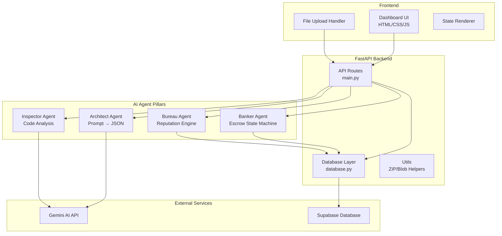
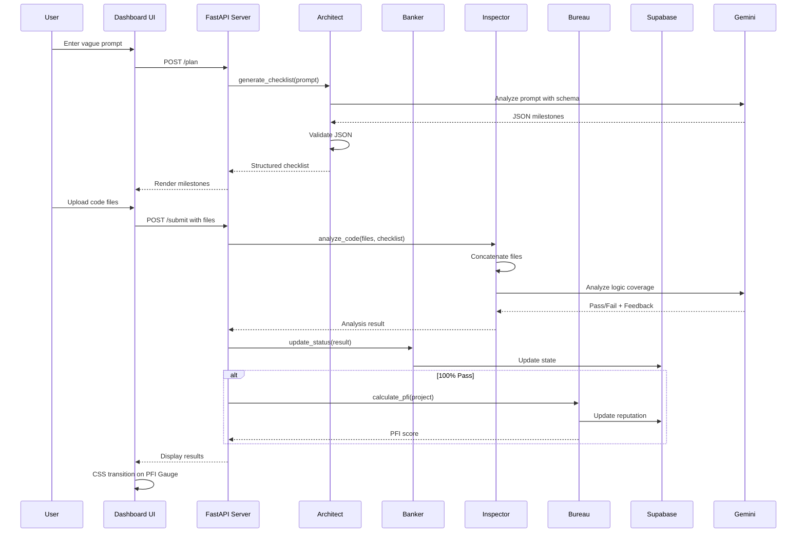

# Design Document: Pillar Protocol

## Overview

The Pillar Protocol is a multi-agent AI platform that orchestrates project planning, escrow management, code inspection, and reputation tracking through four specialized AI agents. The system transforms vague project ideas into structured milestones, manages payment escrow with state-based locking, validates code submissions against requirements, and maintains developer reputation scores. Built with a FastAPI/Python backend, Supabase database, and vanilla JavaScript frontend, the platform provides a complete workflow from project conception through code delivery and reputation assessment.

## Architecture



## Main Workflow Sequence



## Components and Interfaces

### Component 1: FastAPI Server (main.py)

**Purpose**: Central API server that routes requests to appropriate agents and manages HTTP endpoints

**Interface**:
```python
from fastapi import FastAPI, UploadFile, File
from pydantic import BaseModel

class PlanRequest(BaseModel):
    prompt: str
    user_id: str

class SubmitRequest(BaseModel):
    project_id: str
    milestone_id: str

class PlanResponse(BaseModel):
    project_id: str
    milestones: list[dict]

class SubmitResponse(BaseModel):
    passed: bool
    feedback: str
    pfi_score: float | None

# API Endpoints
@app.post("/plan", response_model=PlanResponse)
async def create_plan(request: PlanRequest) -> PlanResponse:
    """Convert vague prompt into structured milestone checklist"""
    pass

@app.post("/submit", response_model=SubmitResponse)
async def submit_code(
    project_id: str,
    milestone_id: str,
    files: list[UploadFile] = File(...)
) -> SubmitResponse:
    """Analyze uploaded code against checklist"""
    pass

@app.get("/project/{project_id}")
async def get_project(project_id: str) -> dict:
    """Retrieve project state and milestones"""
    pass

@app.delete("/milestone/{milestone_id}")
async def delete_milestone(milestone_id: str) -> dict:
    """Delete milestone if not locked"""
    pass
```

**Responsibilities**:
- Route HTTP requests to appropriate agents
- Validate request payloads
- Handle file uploads
- Return structured responses
- Manage CORS for frontend communication


### Component 2: The Architect Agent (architect.py)

**Purpose**: Converts vague user prompts into structured milestone schemas using Gemini AI

**Interface**:
```python
from typing import TypedDict

class Milestone(TypedDict):
    id: str
    title: str
    description: str
    requirements: list[str]
    estimated_hours: int

class ArchitectAgent:
    def __init__(self, gemini_api_key: str):
        """Initialize with Gemini API credentials"""
        pass
    
    def generate_checklist(self, prompt: str) -> list[Milestone]:
        """
        Convert vague prompt into structured milestone list.
        Uses Gemini with system prompt enforcing milestone schema.
        Validates JSON output to prevent hallucinations.
        """
        pass
    
    def _validate_milestone_schema(self, data: dict) -> bool:
        """Validate milestone JSON structure"""
        pass
```

**Responsibilities**:
- Parse user prompts using Gemini AI
- Enforce milestone schema structure
- Validate JSON output with json.loads()
- Return structured milestone data
- Handle API errors gracefully


### Component 3: The Banker Agent (banker.py)

**Purpose**: State machine gatekeeper managing escrow status and payment states

**Interface**:
```python
from enum import Enum

class EscrowStatus(Enum):
    PENDING = "PENDING"
    LOCKED = "LOCKED"
    RELEASED = "RELEASED"
    DISPUTED = "DISPUTED"

class BankerAgent:
    def __init__(self, db_connection):
        """Initialize with database connection"""
        pass
    
    def get_milestone_status(self, milestone_id: str) -> EscrowStatus:
        """Query current escrow status from database"""
        pass
    
    def lock_milestone(self, milestone_id: str) -> bool:
        """Lock milestone, preventing deletion"""
        pass
    
    def release_payment(self, milestone_id: str) -> bool:
        """Release escrowed funds after successful inspection"""
        pass
    
    def can_delete_milestone(self, milestone_id: str) -> bool:
        """Check if milestone can be deleted (not LOCKED)"""
        pass
    
    def simulate_x402_payment(self, amount: float, recipient: str) -> dict:
        """Simulate x402 payment protocol"""
        pass
```

**Responsibilities**:
- Monitor status column in database
- Enforce state-based locking rules
- Prevent deletion when status == 'LOCKED'
- Manage escrow state transitions
- Simulate x402 payment protocol


### Component 4: The Inspector Agent (inspector.py)

**Purpose**: Analyzes uploaded code against checklist requirements for logic coverage

**Interface**:
```python
class InspectionResult(TypedDict):
    passed: bool
    coverage_score: float
    feedback: str
    missing_requirements: list[str]

class InspectorAgent:
    def __init__(self, gemini_api_key: str):
        """Initialize with Gemini API credentials"""
        pass
    
    def analyze_code(
        self,
        files: list[UploadFile],
        checklist: list[Milestone]
    ) -> InspectionResult:
        """
        Analyze uploaded code against checklist.
        Checks logic coverage, not just imports.
        Verifies functions are actually used.
        """
        pass
    
    def _concatenate_files(self, files: list[UploadFile]) -> str:
        """
        Concatenate files with [FILE_START] and [FILE_END] tags.
        Format: [FILE_START:filename.py]\n<content>\n[FILE_END:filename.py]
        """
        pass
    
    def _check_logic_coverage(self, code_blob: str, requirements: list[str]) -> dict:
        """Send to Gemini Flash for logic coverage analysis"""
        pass
```

**Responsibilities**:
- Handle file uploads from HTML input
- Concatenate files with delimiter tags
- Send code to Gemini for analysis
- Check logic coverage (not just imports)
- Verify functions are actually used
- Return pass/fail with detailed feedback


### Component 5: The Credit Bureau Agent (bureau.py)

**Purpose**: Post-submission reputation engine calculating PFI scores and updating developer reputation

**Interface**:
```python
class PFIMetrics(TypedDict):
    performance_score: float  # 0-100
    financial_score: float    # 0-100
    combined_pfi: float       # 0-100

class BureauAgent:
    def __init__(self, db_connection):
        """Initialize with database connection"""
        pass
    
    def calculate_pfi(
        self,
        project_id: str,
        inspection_result: InspectionResult
    ) -> PFIMetrics:
        """
        Calculate Performance/Financial Index.
        Triggered post-submission.
        """
        pass
    
    def update_reputation(self, user_id: str, pfi: PFIMetrics) -> None:
        """Update user reputation score in database"""
        pass
    
    def get_reputation_history(self, user_id: str) -> list[dict]:
        """Retrieve historical reputation data"""
        pass
```

**Responsibilities**:
- Calculate PFI (Performance/Financial Index)
- Update reputation scores in database
- Trigger on successful code submission
- Maintain reputation history
- Provide data for frontend PFI gauge


### Component 6: Database Layer (database.py)

**Purpose**: Supabase connection and state management logic

**Interface**:
```python
from supabase import create_client, Client

class DatabaseManager:
    def __init__(self, supabase_url: str, supabase_key: str):
        """Initialize Supabase client"""
        self.client: Client = create_client(supabase_url, supabase_key)
    
    def create_project(self, user_id: str, milestones: list[dict]) -> str:
        """Create new project with milestones"""
        pass
    
    def get_project(self, project_id: str) -> dict:
        """Retrieve project with all milestones"""
        pass
    
    def update_milestone_status(self, milestone_id: str, status: str) -> None:
        """Update milestone escrow status"""
        pass
    
    def delete_milestone(self, milestone_id: str) -> bool:
        """Delete milestone if not locked"""
        pass
    
    def save_inspection_result(
        self,
        milestone_id: str,
        result: InspectionResult
    ) -> None:
        """Save code inspection results"""
        pass
    
    def update_user_reputation(self, user_id: str, pfi: float) -> None:
        """Update user reputation score"""
        pass
```

**Responsibilities**:
- Manage Supabase connection
- CRUD operations for projects and milestones
- State management for escrow status
- Store inspection results
- Update reputation scores


### Component 7: Frontend Dashboard (index.html, style.css, script.js)

**Purpose**: User interface with "AI Startup" aesthetic featuring glows and terminal styling

**Interface**:
```python
# JavaScript API Client Interface
class PillarAPIClient:
    def __init__(self, base_url: str):
        """Initialize API client with backend URL"""
        pass
    
    async def create_plan(self, prompt: str, user_id: str) -> dict:
        """POST /plan - Create milestone checklist"""
        pass
    
    async def submit_code(
        self,
        project_id: str,
        milestone_id: str,
        files: FileList
    ) -> dict:
        """POST /submit - Submit code for inspection"""
        pass
    
    async def get_project(self, project_id: str) -> dict:
        """GET /project/{id} - Retrieve project state"""
        pass
    
    async def delete_milestone(self, milestone_id: str) -> dict:
        """DELETE /milestone/{id} - Delete unlocked milestone"""
        pass
```

**Responsibilities**:
- Render dashboard with tab switching
- Handle file uploads via HTML input
- Display milestone checklists
- Show PFI gauge with CSS transitions
- Disable delete buttons when status == 'LOCKED'
- Real-time state rendering
- Terminal-style UI with glow effects


### Component 8: Utilities (utils/)

**Purpose**: Helper functions for file processing and code manipulation

**Interface**:
```python
# utils/file_processor.py
def parse_zip_file(zip_file: UploadFile) -> list[tuple[str, str]]:
    """Extract files from ZIP upload"""
    pass

def concatenate_code_files(files: list[tuple[str, str]]) -> str:
    """
    Concatenate files with delimiters.
    Format: [FILE_START:filename]\ncontent\n[FILE_END:filename]
    """
    pass

# utils/validators.py
def validate_milestone_schema(data: dict) -> bool:
    """Validate milestone JSON structure"""
    pass

def validate_file_types(files: list[UploadFile]) -> bool:
    """Ensure uploaded files are valid code files"""
    pass
```

**Responsibilities**:
- ZIP file parsing
- Code file concatenation with tags
- Schema validation
- File type validation


## Data Models

### Project Model

```python
from datetime import datetime
from typing import Literal

class Project:
    id: str
    user_id: str
    title: str
    description: str
    created_at: datetime
    updated_at: datetime
    milestones: list['Milestone']
    total_pfi: float | None
```

**Validation Rules**:
- id must be valid UUID
- user_id must reference existing user
- title must be non-empty string (max 200 chars)
- description can be empty
- milestones list can be empty initially

### Milestone Model

```python
class Milestone:
    id: str
    project_id: str
    title: str
    description: str
    requirements: list[str]
    estimated_hours: int
    status: Literal['PENDING', 'LOCKED', 'RELEASED', 'DISPUTED']
    escrow_amount: float | None
    created_at: datetime
    submitted_at: datetime | None
    inspection_result: 'InspectionResult' | None
```

**Validation Rules**:
- id must be valid UUID
- project_id must reference existing project
- title must be non-empty (max 200 chars)
- requirements must be non-empty list
- estimated_hours must be positive integer
- status must be one of enum values
- escrow_amount must be positive if set


### InspectionResult Model

```python
class InspectionResult:
    milestone_id: str
    passed: bool
    coverage_score: float  # 0-100
    feedback: str
    missing_requirements: list[str]
    analyzed_at: datetime
    code_blob_hash: str  # SHA256 of submitted code
```

**Validation Rules**:
- milestone_id must reference existing milestone
- passed must be boolean
- coverage_score must be 0-100
- feedback must be non-empty string
- missing_requirements can be empty list if passed
- code_blob_hash must be valid SHA256

### User Reputation Model

```python
class UserReputation:
    user_id: str
    current_pfi: float  # 0-100
    total_projects: int
    successful_submissions: int
    failed_submissions: int
    average_coverage: float
    reputation_history: list['PFISnapshot']
    updated_at: datetime
```

**Validation Rules**:
- user_id must be valid UUID
- current_pfi must be 0-100
- counts must be non-negative integers
- average_coverage must be 0-100
- reputation_history ordered by timestamp

### PFISnapshot Model

```python
class PFISnapshot:
    timestamp: datetime
    pfi_score: float
    project_id: str
    milestone_id: str
```

**Validation Rules**:
- timestamp must be valid datetime
- pfi_score must be 0-100
- project_id and milestone_id must be valid UUIDs


## Key Functions with Formal Specifications

### Function 1: generate_checklist()

```python
def generate_checklist(self, prompt: str) -> list[Milestone]:
    """Convert vague prompt into structured milestone list"""
    pass
```

**Preconditions:**
- `prompt` is non-empty string
- Gemini API key is valid and configured
- System prompt for milestone schema is loaded

**Postconditions:**
- Returns list of valid Milestone objects
- Each milestone has valid schema (id, title, description, requirements)
- JSON is validated with json.loads() to prevent hallucinations
- If API fails, raises appropriate exception
- No side effects on input prompt

**Loop Invariants:** N/A (no explicit loops in function signature)

### Function 2: analyze_code()

```python
def analyze_code(
    self,
    files: list[UploadFile],
    checklist: list[Milestone]
) -> InspectionResult:
    """Analyze uploaded code against checklist"""
    pass
```

**Preconditions:**
- `files` is non-empty list of valid code files
- `checklist` contains at least one milestone with requirements
- Gemini API key is valid
- Files are readable and contain valid text

**Postconditions:**
- Returns InspectionResult with passed boolean
- coverage_score is between 0-100
- feedback is non-empty descriptive string
- missing_requirements lists unmet requirements if not passed
- Checks logic coverage, not just imports
- Verifies functions are actually used in code

**Loop Invariants:**
- For file concatenation loop: All processed files maintain [FILE_START]/[FILE_END] format
- All files in list are processed exactly once


### Function 3: calculate_pfi()

```python
def calculate_pfi(
    self,
    project_id: str,
    inspection_result: InspectionResult
) -> PFIMetrics:
    """Calculate Performance/Financial Index"""
    pass
```

**Preconditions:**
- `project_id` references existing project in database
- `inspection_result.passed` is True (only called on success)
- `inspection_result.coverage_score` is valid (0-100)
- User has existing reputation record

**Postconditions:**
- Returns PFIMetrics with all scores between 0-100
- performance_score reflects code quality and coverage
- financial_score reflects project completion rate
- combined_pfi is weighted average of performance and financial
- Database is updated with new PFI score
- Reputation history is appended with new snapshot

**Loop Invariants:** N/A (calculation-focused function)

### Function 4: lock_milestone()

```python
def lock_milestone(self, milestone_id: str) -> bool:
    """Lock milestone, preventing deletion"""
    pass
```

**Preconditions:**
- `milestone_id` references existing milestone
- Database connection is active
- Milestone current status is 'PENDING'

**Postconditions:**
- Returns True if lock successful, False otherwise
- Milestone status updated to 'LOCKED' in database
- Frontend delete button becomes disabled
- Subsequent delete attempts return error
- Transaction is atomic (all-or-nothing)

**Loop Invariants:** N/A (single database operation)


### Function 5: concatenate_code_files()

```python
def concatenate_code_files(files: list[tuple[str, str]]) -> str:
    """Concatenate files with [FILE_START] and [FILE_END] tags"""
    pass
```

**Preconditions:**
- `files` is list of (filename, content) tuples
- All filenames are non-empty strings
- All content strings are valid UTF-8 text
- List contains at least one file

**Postconditions:**
- Returns single concatenated string
- Each file wrapped with [FILE_START:filename] and [FILE_END:filename]
- Files separated by newlines
- Order of files preserved from input list
- No content is lost or modified
- Format: `[FILE_START:name]\ncontent\n[FILE_END:name]\n`

**Loop Invariants:**
- All previously processed files maintain correct tag format
- Concatenated string grows monotonically
- No duplicate file tags in output

## Algorithmic Pseudocode

### Main Processing Algorithm: Code Submission Workflow

```python
def process_code_submission(
    project_id: str,
    milestone_id: str,
    files: list[UploadFile]
) -> SubmitResponse:
    """
    Main workflow for code submission and inspection.
    
    INPUT: project_id, milestone_id, uploaded files
    OUTPUT: SubmitResponse with pass/fail and PFI
    """
    # Step 1: Validate inputs
    assert project_id is not None and milestone_id is not None
    assert len(files) > 0
    
    project = database.get_project(project_id)
    milestone = next(m for m in project.milestones if m.id == milestone_id)
    
    assert milestone.status == 'PENDING'
    
    # Step 2: Lock milestone to prevent deletion
    banker.lock_milestone(milestone_id)
    assert milestone.status == 'LOCKED'
    
    # Step 3: Concatenate uploaded files
    code_blob = inspector._concatenate_files(files)
    assert '[FILE_START' in code_blob and '[FILE_END' in code_blob
    
    # Step 4: Analyze code with Inspector
    inspection_result = inspector.analyze_code(files, [milestone])
    
    # Step 5: Save inspection result
    database.save_inspection_result(milestone_id, inspection_result)
    
    # Step 6: If passed, calculate PFI and update reputation
    pfi_score = None
    if inspection_result.passed:
        pfi_metrics = bureau.calculate_pfi(project_id, inspection_result)
        bureau.update_reputation(project.user_id, pfi_metrics)
        banker.release_payment(milestone_id)
        pfi_score = pfi_metrics.combined_pfi
        
        assert milestone.status == 'RELEASED'
    
    # Step 7: Return response
    return SubmitResponse(
        passed=inspection_result.passed,
        feedback=inspection_result.feedback,
        pfi_score=pfi_score
    )
```

**Preconditions:**
- project_id and milestone_id reference existing records
- files list is non-empty
- milestone status is 'PENDING'
- All agents (banker, inspector, bureau) are initialized

**Postconditions:**
- Milestone is locked (status = 'LOCKED')
- Inspection result is saved to database
- If passed: PFI calculated, reputation updated, payment released
- Returns valid SubmitResponse
- Frontend receives pass/fail feedback

**Loop Invariants:** N/A (sequential workflow, no explicit loops)


### Architect Algorithm: Prompt to Milestone Conversion

```python
def generate_checklist_algorithm(prompt: str) -> list[Milestone]:
    """
    Convert vague prompt into structured milestones using Gemini AI.
    
    INPUT: prompt (user's vague project description)
    OUTPUT: list of validated Milestone objects
    """
    # Step 1: Prepare system prompt with schema enforcement
    system_prompt = """
    You are a project planning AI. Convert the user's prompt into a JSON array
    of milestones. Each milestone must have:
    - id: unique identifier
    - title: short descriptive title
    - description: detailed explanation
    - requirements: list of specific deliverables
    - estimated_hours: integer estimate
    
    Return ONLY valid JSON, no additional text.
    """
    
    # Step 2: Call Gemini API
    response = gemini_client.generate_content(
        prompt=f"{system_prompt}\n\nUser prompt: {prompt}"
    )
    
    # Step 3: Extract and validate JSON
    raw_json = response.text.strip()
    
    # Remove markdown code blocks if present
    if raw_json.startswith('```'):
        raw_json = extract_json_from_markdown(raw_json)
    
    # Step 4: Parse JSON to prevent hallucinations
    try:
        milestones_data = json.loads(raw_json)
    except json.JSONDecodeError as e:
        raise ValueError(f"Invalid JSON from Gemini: {e}")
    
    # Step 5: Validate schema for each milestone
    validated_milestones = []
    for data in milestones_data:
        assert 'id' in data and 'title' in data
        assert 'requirements' in data and len(data['requirements']) > 0
        assert 'estimated_hours' in data and data['estimated_hours'] > 0
        
        validated_milestones.append(Milestone(**data))
    
    assert len(validated_milestones) > 0
    
    return validated_milestones
```

**Preconditions:**
- prompt is non-empty string
- Gemini API client is initialized with valid key
- System prompt template is loaded

**Postconditions:**
- Returns list of validated Milestone objects
- Each milestone has all required fields
- JSON is successfully parsed (no hallucinations)
- If validation fails, raises ValueError
- At least one milestone is returned

**Loop Invariants:**
- For validation loop: All previously validated milestones have complete schema
- validated_milestones list grows monotonically


### Inspector Algorithm: Code Analysis with Logic Coverage

```python
def analyze_code_algorithm(
    files: list[UploadFile],
    checklist: list[Milestone]
) -> InspectionResult:
    """
    Analyze code for logic coverage against requirements.
    
    INPUT: uploaded files, milestone checklist
    OUTPUT: InspectionResult with pass/fail and feedback
    """
    # Step 1: Concatenate files with delimiters
    code_blob = ""
    for file in files:
        content = file.read().decode('utf-8')
        code_blob += f"[FILE_START:{file.filename}]\n"
        code_blob += content
        code_blob += f"\n[FILE_END:{file.filename}]\n\n"
    
    assert len(code_blob) > 0
    
    # Step 2: Extract requirements from checklist
    all_requirements = []
    for milestone in checklist:
        all_requirements.extend(milestone.requirements)
    
    assert len(all_requirements) > 0
    
    # Step 3: Build analysis prompt for Gemini
    analysis_prompt = f"""
    Analyze this code for LOGIC COVERAGE against requirements.
    
    Requirements:
    {json.dumps(all_requirements, indent=2)}
    
    Code:
    {code_blob}
    
    Check:
    1. Are all requirements implemented with actual logic?
    2. Are functions defined AND actually used?
    3. Is there real functionality, not just imports?
    
    Return JSON:
    {{
        "passed": boolean,
        "coverage_score": 0-100,
        "feedback": "detailed explanation",
        "missing_requirements": ["list of unmet requirements"]
    }}
    """
    
    # Step 4: Call Gemini Flash for analysis
    response = gemini_client.generate_content(prompt=analysis_prompt)
    result_data = json.loads(response.text.strip())
    
    # Step 5: Validate result structure
    assert 'passed' in result_data and isinstance(result_data['passed'], bool)
    assert 'coverage_score' in result_data
    assert 0 <= result_data['coverage_score'] <= 100
    
    # Step 6: Create InspectionResult
    return InspectionResult(
        milestone_id=checklist[0].id,
        passed=result_data['passed'],
        coverage_score=result_data['coverage_score'],
        feedback=result_data['feedback'],
        missing_requirements=result_data['missing_requirements'],
        analyzed_at=datetime.now(),
        code_blob_hash=hashlib.sha256(code_blob.encode()).hexdigest()
    )
```

**Preconditions:**
- files list is non-empty
- checklist contains at least one milestone with requirements
- All files are readable UTF-8 text
- Gemini API client is initialized

**Postconditions:**
- Returns valid InspectionResult
- coverage_score is 0-100
- passed is True only if coverage_score meets threshold
- feedback provides actionable information
- missing_requirements lists specific unmet items
- code_blob_hash uniquely identifies submission

**Loop Invariants:**
- File concatenation loop: code_blob grows with each file
- All files maintain [FILE_START]/[FILE_END] format
- Requirements extraction: all_requirements grows monotonically


### Bureau Algorithm: PFI Calculation

```python
def calculate_pfi_algorithm(
    project_id: str,
    inspection_result: InspectionResult
) -> PFIMetrics:
    """
    Calculate Performance/Financial Index for reputation.
    
    INPUT: project_id, inspection result
    OUTPUT: PFIMetrics with performance, financial, and combined scores
    """
    # Step 1: Retrieve project and user data
    project = database.get_project(project_id)
    user_reputation = database.get_user_reputation(project.user_id)
    
    # Step 2: Calculate performance score (based on code quality)
    performance_score = inspection_result.coverage_score
    
    # Adjust for historical performance
    if user_reputation.total_projects > 0:
        historical_weight = 0.3
        performance_score = (
            performance_score * (1 - historical_weight) +
            user_reputation.average_coverage * historical_weight
        )
    
    assert 0 <= performance_score <= 100
    
    # Step 3: Calculate financial score (based on completion rate)
    total_milestones = len(project.milestones)
    completed_milestones = sum(
        1 for m in project.milestones if m.status == 'RELEASED'
    )
    
    completion_rate = completed_milestones / total_milestones
    financial_score = completion_rate * 100
    
    # Adjust for success rate
    if user_reputation.total_projects > 0:
        success_rate = (
            user_reputation.successful_submissions /
            (user_reputation.successful_submissions + user_reputation.failed_submissions)
        )
        financial_score = financial_score * 0.7 + success_rate * 100 * 0.3
    
    assert 0 <= financial_score <= 100
    
    # Step 4: Calculate combined PFI (weighted average)
    performance_weight = 0.6
    financial_weight = 0.4
    
    combined_pfi = (
        performance_score * performance_weight +
        financial_score * financial_weight
    )
    
    assert 0 <= combined_pfi <= 100
    
    # Step 5: Return metrics
    return PFIMetrics(
        performance_score=performance_score,
        financial_score=financial_score,
        combined_pfi=combined_pfi
    )
```

**Preconditions:**
- project_id references existing project
- inspection_result.passed is True
- inspection_result.coverage_score is valid (0-100)
- User reputation record exists in database

**Postconditions:**
- Returns PFIMetrics with all scores 0-100
- performance_score reflects code quality and history
- financial_score reflects completion and success rates
- combined_pfi is weighted average (60% performance, 40% financial)
- All assertions pass (scores in valid range)

**Loop Invariants:**
- Milestone counting loop: completed_milestones ≤ total_milestones
- All milestones processed exactly once


## Example Usage

### Example 1: Complete Workflow - From Prompt to Payment

```python
# Frontend: User enters vague prompt
prompt = "Build an image processing pipeline with filters"
user_id = "user-123"

# Step 1: Create plan via Architect
response = await fetch('/plan', {
    method: 'POST',
    body: JSON.stringify({ prompt, user_id })
})
plan = await response.json()

# Backend processes:
# - Architect converts prompt to milestones
# - Returns: { project_id: "proj-456", milestones: [...] }

# Step 2: User uploads code files
files = document.getElementById('file-input').files
formData = new FormData()
formData.append('project_id', plan.project_id)
formData.append('milestone_id', plan.milestones[0].id)
for (let file of files) {
    formData.append('files', file)
}

# Step 3: Submit code for inspection
response = await fetch('/submit', {
    method: 'POST',
    body: formData
})
result = await response.json()

# Backend processes:
# - Banker locks milestone
# - Inspector analyzes code
# - If passed: Bureau calculates PFI, releases payment
# - Returns: { passed: true, feedback: "...", pfi_score: 87.5 }

# Step 4: Frontend updates UI
if (result.passed) {
    showSuccessMessage(result.feedback)
    animatePFIGauge(result.pfi_score)  // CSS transition
} else {
    showErrorMessage(result.feedback)
}
```


### Example 2: Backend Agent Initialization

```python
# main.py - Server initialization
from fastapi import FastAPI
from dotenv import load_dotenv
import os

from architect import ArchitectAgent
from banker import BankerAgent
from inspector import InspectorAgent
from bureau import BureauAgent
from database import DatabaseManager

# Load environment variables
load_dotenv()

# Initialize database
db = DatabaseManager(
    supabase_url=os.getenv('SUPABASE_URL'),
    supabase_key=os.getenv('SUPABASE_KEY')
)

# Initialize agents
architect = ArchitectAgent(gemini_api_key=os.getenv('GEMINI_API_KEY'))
banker = BankerAgent(db_connection=db)
inspector = InspectorAgent(gemini_api_key=os.getenv('GEMINI_API_KEY'))
bureau = BureauAgent(db_connection=db)

# Create FastAPI app
app = FastAPI(title="Pillar Protocol API")

# API routes use initialized agents
@app.post("/plan")
async def create_plan(request: PlanRequest):
    milestones = architect.generate_checklist(request.prompt)
    project_id = db.create_project(request.user_id, milestones)
    return {"project_id": project_id, "milestones": milestones}
```

### Example 3: Demo Templates Usage

```python
# Using "The Good Code" demo template
from templates.image_pipeline import ImagePipeline

# This template demonstrates 100% pass scenario
pipeline = ImagePipeline()
pipeline.apply_grayscale("input.jpg")
pipeline.apply_blur("input.jpg", radius=5)
pipeline.save_output("output.jpg")

# Inspector will analyze and find:
# - All required functions implemented
# - Functions are actually called (not just defined)
# - Logic coverage: 100%
# Result: PASS

# Using "The Bad Code" demo template
from templates.broken_pipeline import BrokenPipeline

# This template demonstrates fail/feedback scenario
pipeline = BrokenPipeline()
# Missing implementations, unused functions
# Inspector will find:
# - Required functions not implemented
# - Functions defined but never called
# - Logic coverage: 40%
# Result: FAIL with specific feedback
```


### Example 4: State Locking Mechanism

```python
# Frontend: Attempt to delete milestone
async function deleteMilestone(milestoneId) {
    // Check status first
    const project = await fetch(`/project/${projectId}`).then(r => r.json())
    const milestone = project.milestones.find(m => m.id === milestoneId)
    
    if (milestone.status === 'LOCKED') {
        alert('Cannot delete locked milestone')
        return
    }
    
    // Proceed with deletion
    await fetch(`/milestone/${milestoneId}`, { method: 'DELETE' })
}

# Backend: Banker enforces locking
class BankerAgent:
    def can_delete_milestone(self, milestone_id: str) -> bool:
        status = self.get_milestone_status(milestone_id)
        return status != EscrowStatus.LOCKED
    
    def delete_milestone_safe(self, milestone_id: str) -> bool:
        if not self.can_delete_milestone(milestone_id):
            raise ValueError("Cannot delete locked milestone")
        
        return self.db.delete_milestone(milestone_id)

# Frontend: Disable delete buttons for locked milestones
function renderMilestones(milestones) {
    milestones.forEach(milestone => {
        const deleteBtn = document.createElement('button')
        deleteBtn.textContent = 'Delete'
        deleteBtn.disabled = milestone.status === 'LOCKED'
        deleteBtn.onclick = () => deleteMilestone(milestone.id)
    })
}
```


## Correctness Properties

*A property is a characteristic or behavior that should hold true across all valid executions of a system—essentially, a formal statement about what the system should do. Properties serve as the bridge between human-readable specifications and machine-verifiable correctness guarantees.*

### Property 1: Milestone Schema Validation

*For any* milestone generated by the Architect Agent, it must contain a non-null id, non-empty title, non-empty requirements list, and positive estimated_hours value.

**Validates: Requirements 1.2, 1.6, 1.7, 8.3, 8.4, 8.5, 19.4, 19.5, 19.6**

### Property 2: State Locking Invariant

*For any* milestone in the database with status LOCKED, deletion operations must be forbidden and the frontend delete button must be disabled.

**Validates: Requirements 4.3, 4.4, 7.3, 17.3, 17.4, 17.5, 17.6**

### Property 3: Logic Coverage Analysis

*For any* code submission that passes inspection, every requirement in the checklist must have a corresponding function that both implements the requirement and is actually called within the submitted code.

**Validates: Requirements 3.1, 3.2, 3.3, 20.2, 20.5, 20.6**

### Property 4: PFI Score Bounds and Formula

*For any* PFI calculation, the performance_score, financial_score, and combined_pfi must all be between 0 and 100, and the combined_pfi must equal (performance_score × 0.6 + financial_score × 0.4).

**Validates: Requirements 5.2, 5.3, 5.4, 8.7**

### Property 5: File Concatenation Format and Preservation

*For any* list of uploaded files, the concatenated code_blob must wrap each file with [FILE_START:filename] and [FILE_END:filename] tags, preserve all original content without modification, and process each file exactly once.

**Validates: Requirements 2.5, 2.6, 2.7, 16.1, 16.2, 16.3, 16.4, 16.5, 16.6**

### Property 6: Payment Release Condition

*For any* milestone with status RELEASED, the inspection result must have passed, PFI must have been calculated for the project, and user reputation must have been updated.

**Validates: Requirements 4.5, 4.6, 5.1, 5.9, 5.10**

### Property 7: JSON Parsing and Validation

*For any* Gemini API response, if it contains valid JSON then parsing must succeed and return structured data, and if it contains invalid JSON then parsing must raise a ValueError with a descriptive message.

**Validates: Requirements 1.3, 1.4, 19.1, 19.2**

### Property 8: Milestone Generation Guarantee

*For any* non-empty prompt submitted to the Architect Agent, at least one valid milestone must be generated and returned.

**Validates: Requirements 1.1, 1.5**

### Property 9: State Transition Correctness

*For any* milestone in PENDING status, when code is submitted, the status must transition to LOCKED.

**Validates: Requirements 4.1, 4.2**

### Property 10: Deletion Permission Rules

*For any* milestone with status PENDING, deletion must be allowed, and for any milestone with status LOCKED, RELEASED, or DISPUTED, deletion must be prevented.

**Validates: Requirements 4.8, 17.1, 17.2, 17.3, 17.4, 17.5**

### Property 11: Inspection Result Completeness

*For any* completed code inspection, the result must include a coverage_score between 0 and 100, a non-empty feedback string, and a boolean passed status.

**Validates: Requirements 3.4, 3.5, 3.6, 20.1**

### Property 12: File Type Validation

*For any* uploaded file, if its extension is in the allowed list (.py, .js, .ts, .java, .cpp, .c, .go, .rs) then it must be accepted, and if its extension is not in the allowed list then it must be rejected with a 400 error.

**Validates: Requirements 2.2, 28.1, 28.2, 28.3, 28.6**

### Property 13: Transaction Atomicity

*For any* database transaction involving project and milestone creation, either all data must be successfully persisted or all changes must be rolled back with no partial state.

**Validates: Requirements 13.1, 13.5, 27.1, 27.4, 27.5**

### Property 14: No Code Execution Security

*For any* code analysis operation, the system must perform only static analysis without executing any uploaded code.

**Validates: Requirements 11.4**

### Property 15: Frontend State Synchronization

*For any* milestone displayed in the frontend, the delete button disabled state must match the milestone's lock status (disabled when LOCKED, enabled when PENDING).

**Validates: Requirements 7.3, 7.4, 15.3**

### Property 16: Coverage Score Bounds

*For any* inspection result, the coverage_score must be between 0 and 100 inclusive.

**Validates: Requirements 3.4, 8.6**

### Property 17: File Content Preservation

*For any* file concatenation operation, all original file content must appear in the concatenated result without any modifications.

**Validates: Requirements 2.6, 16.3**

### Property 18: Reputation History Append-Only

*For any* PFI calculation, a new PFISnapshot must be appended to the user's reputation_history with timestamp, pfi_score, project_id, and milestone_id.

**Validates: Requirements 5.10, 18.1, 18.2, 18.3**


## Error Handling

### Error Scenario 1: Invalid Gemini API Response

**Condition:** Gemini returns non-JSON or malformed response
**Response:** 
- Catch json.JSONDecodeError in architect.generate_checklist()
- Log error with request details
- Return 500 error to frontend with message: "Failed to generate plan"
**Recovery:** 
- User can retry with modified prompt
- System logs error for debugging
- No database state is modified

### Error Scenario 2: Locked Milestone Deletion Attempt

**Condition:** User attempts to delete milestone with status='LOCKED'
**Response:**
- Banker.can_delete_milestone() returns False
- API returns 403 Forbidden with message: "Cannot delete locked milestone"
- Frontend shows error notification
**Recovery:**
- User must wait for milestone completion or dispute resolution
- Delete button remains disabled in UI
- No database modification occurs

### Error Scenario 3: File Upload Failure

**Condition:** Uploaded files are corrupted, wrong format, or too large
**Response:**
- Validate file types in utils.validators.validate_file_types()
- Check file size limits (max 10MB per file)
- Return 400 Bad Request with specific error message
**Recovery:**
- User re-uploads valid files
- Frontend shows file validation errors
- No partial data is saved

### Error Scenario 4: Code Inspection Failure

**Condition:** Inspector cannot analyze code (Gemini API error, timeout)
**Response:**
- Catch API exceptions in inspector.analyze_code()
- Milestone remains in 'LOCKED' state
- Return 500 error with message: "Code analysis failed, please retry"
**Recovery:**
- User can resubmit code
- Milestone stays locked (prevents deletion)
- Admin can manually review if repeated failures

### Error Scenario 5: Database Connection Loss

**Condition:** Supabase connection drops during operation
**Response:**
- Database operations wrapped in try-except blocks
- Return 503 Service Unavailable
- Log connection error details
**Recovery:**
- Automatic retry with exponential backoff
- User sees "Service temporarily unavailable" message
- No data corruption due to transaction rollback

### Error Scenario 6: PFI Calculation Error

**Condition:** Invalid data during PFI calculation (division by zero, missing fields)
**Response:**
- Validate inputs before calculation
- Use safe division with zero checks
- Return default PFI score (50.0) if calculation fails
- Log error for investigation
**Recovery:**
- User reputation updated with default score
- Payment still released (don't block user)
- Admin notified for manual review


## Testing Strategy

### Unit Testing Approach

**Test Coverage Goals:** 80% code coverage minimum

**Key Test Cases:**

1. **Architect Agent Tests**
   - Test valid prompt conversion to milestones
   - Test JSON validation with malformed responses
   - Test schema enforcement (missing fields)
   - Test empty prompt handling
   - Mock Gemini API responses

2. **Banker Agent Tests**
   - Test state transitions (PENDING → LOCKED → RELEASED)
   - Test deletion prevention when locked
   - Test can_delete_milestone() logic
   - Test x402 payment simulation
   - Mock database operations

3. **Inspector Agent Tests**
   - Test file concatenation with delimiters
   - Test logic coverage detection (functions defined AND used)
   - Test pass/fail threshold logic
   - Test missing requirements identification
   - Mock Gemini API responses

4. **Bureau Agent Tests**
   - Test PFI calculation formula
   - Test score bounds (0-100)
   - Test reputation history updates
   - Test weighted average calculation
   - Mock database operations

5. **Database Layer Tests**
   - Test CRUD operations for projects/milestones
   - Test transaction atomicity
   - Test connection error handling
   - Use test database instance

**Testing Framework:** pytest with pytest-asyncio for async tests

**Example Unit Test:**
```python
import pytest
from architect import ArchitectAgent

def test_generate_checklist_valid_prompt(mock_gemini):
    agent = ArchitectAgent(api_key="test-key")
    mock_gemini.return_value = '[{"id": "1", "title": "Test", "requirements": ["req1"], "estimated_hours": 5}]'
    
    result = agent.generate_checklist("Build an API")
    
    assert len(result) == 1
    assert result[0]['title'] == "Test"
    assert len(result[0]['requirements']) > 0
```


### Property-Based Testing Approach

**Property Test Library:** Hypothesis (Python)

**Property Tests:**

1. **Milestone Schema Property**
```python
from hypothesis import given, strategies as st

@given(st.text(min_size=1), st.lists(st.text(min_size=1), min_size=1))
def test_milestone_schema_always_valid(title, requirements):
    milestone = {
        "id": str(uuid.uuid4()),
        "title": title,
        "requirements": requirements,
        "estimated_hours": 5
    }
    assert validate_milestone_schema(milestone) == True
```

2. **PFI Score Bounds Property**
```python
@given(st.floats(min_value=0, max_value=100), st.floats(min_value=0, max_value=100))
def test_pfi_always_in_bounds(performance, financial):
    pfi = calculate_combined_pfi(performance, financial)
    assert 0 <= pfi <= 100
```

3. **File Concatenation Property**
```python
@given(st.lists(st.tuples(st.text(min_size=1), st.text()), min_size=1))
def test_concatenation_preserves_all_files(files):
    result = concatenate_code_files(files)
    for filename, content in files:
        assert f"[FILE_START:{filename}]" in result
        assert f"[FILE_END:{filename}]" in result
        assert content in result
```

**Property Test Goals:**
- Verify invariants hold for arbitrary inputs
- Test edge cases automatically
- Ensure mathematical properties (bounds, ordering)
- Validate data structure integrity


### Integration Testing Approach

**Integration Test Scenarios:**

1. **End-to-End Workflow Test**
   - Start with user prompt
   - Generate milestones via Architect
   - Upload demo code files
   - Verify Inspector analysis
   - Check Banker state transitions
   - Validate Bureau PFI calculation
   - Confirm database state consistency

2. **API Endpoint Integration**
   - Test POST /plan with real Gemini API (staging key)
   - Test POST /submit with file uploads
   - Test GET /project with database queries
   - Test DELETE /milestone with state checks
   - Verify CORS headers and error responses

3. **Database Integration**
   - Test Supabase connection and queries
   - Test transaction rollback on errors
   - Test concurrent access scenarios
   - Verify foreign key constraints

4. **Frontend-Backend Integration**
   - Test file upload from HTML form
   - Test tab switching and state rendering
   - Test PFI gauge CSS transitions
   - Test delete button disable/enable logic

**Testing Environment:**
- Use staging Gemini API key
- Use test Supabase project
- Run integration tests in CI/CD pipeline
- Mock external services for faster tests

**Example Integration Test:**
```python
import pytest
from fastapi.testclient import TestClient
from main import app

client = TestClient(app)

def test_complete_workflow():
    # Step 1: Create plan
    response = client.post("/plan", json={
        "prompt": "Build image pipeline",
        "user_id": "test-user"
    })
    assert response.status_code == 200
    project_id = response.json()["project_id"]
    
    # Step 2: Submit code
    with open("templates/image_pipeline.py", "rb") as f:
        response = client.post("/submit", files={"files": f}, data={
            "project_id": project_id,
            "milestone_id": "milestone-1"
        })
    
    assert response.status_code == 200
    assert response.json()["passed"] == True
    assert response.json()["pfi_score"] > 0
```


## Performance Considerations

### API Response Times
- Target: < 2 seconds for /plan endpoint (Gemini API call)
- Target: < 5 seconds for /submit endpoint (code analysis)
- Target: < 500ms for /project GET requests (database query)
- Implement request timeouts (30s for Gemini calls)

### File Upload Limits
- Max file size: 10MB per file
- Max total upload: 50MB per submission
- Supported formats: .py, .js, .ts, .java, .cpp, .c, .go, .rs
- Reject binary files and archives (except .zip)

### Database Query Optimization
- Index on project_id, user_id, milestone_id columns
- Use connection pooling for Supabase client
- Implement caching for user reputation queries (5 min TTL)
- Batch insert for multiple milestones

### Gemini API Rate Limiting
- Implement exponential backoff for rate limit errors
- Queue requests if rate limit exceeded
- Use Gemini Flash (faster, cheaper) for Inspector
- Use Gemini Pro for Architect (better reasoning)

### Frontend Performance
- Lazy load project history (pagination)
- Debounce file upload preview
- Use CSS transitions (not JavaScript animations) for PFI gauge
- Minimize DOM updates with virtual DOM diffing

### Scalability Considerations
- Horizontal scaling: Stateless FastAPI servers
- Database: Supabase handles scaling automatically
- File storage: Consider S3 for large code submissions
- Background jobs: Use Celery for async PFI calculations


## Security Considerations

### API Authentication
- Implement JWT-based authentication for all endpoints
- Validate user_id in requests matches authenticated user
- Use HTTPS only (no HTTP)
- Implement rate limiting per user (100 requests/hour)

### Input Validation
- Sanitize all user inputs (prompts, filenames)
- Validate file types and sizes before processing
- Prevent path traversal attacks in file uploads
- Escape special characters in database queries

### Code Analysis Security
- Sandbox code execution (do NOT execute uploaded code)
- Only static analysis via Gemini (no eval/exec)
- Limit code blob size to prevent memory exhaustion
- Scan for malicious patterns (SQL injection, XSS)

### Database Security
- Use Supabase Row Level Security (RLS) policies
- Encrypt sensitive data at rest
- Use parameterized queries (prevent SQL injection)
- Implement audit logging for all state changes

### API Key Management
- Store API keys in environment variables (.env)
- Never commit .env to version control
- Rotate keys regularly (quarterly)
- Use separate keys for dev/staging/production

### Payment Security (x402 Simulation)
- Implement escrow state machine strictly
- Prevent double-spending with database constraints
- Log all payment state transitions
- Require multi-signature for large amounts (future)

### Frontend Security
- Implement CORS with whitelist
- Sanitize all rendered content (prevent XSS)
- Use Content Security Policy (CSP) headers
- Validate file uploads client-side (pre-filter)

### Threat Model
- **Threat:** Malicious code in uploads
  - **Mitigation:** Static analysis only, no execution
- **Threat:** Prompt injection attacks on Gemini
  - **Mitigation:** System prompt isolation, output validation
- **Threat:** Unauthorized milestone deletion
  - **Mitigation:** State locking, authentication checks
- **Threat:** PFI score manipulation
  - **Mitigation:** Server-side calculation, audit logs


## Dependencies

### Backend Dependencies (requirements.txt)

```
fastapi==0.104.1
uvicorn[standard]==0.24.0
python-dotenv==1.0.0
google-generativeai==0.3.1
supabase==2.0.3
pydantic==2.5.0
python-multipart==0.0.6
pytest==7.4.3
pytest-asyncio==0.21.1
hypothesis==6.92.1
```

### Frontend Dependencies

- No external JavaScript libraries (vanilla JS)
- CSS3 for animations and transitions
- HTML5 File API for uploads
- Fetch API for HTTP requests

### External Services

1. **Gemini AI API**
   - Provider: Google
   - Models: Gemini Pro (Architect), Gemini Flash (Inspector)
   - Authentication: API key
   - Rate limits: 60 requests/minute (free tier)

2. **Supabase**
   - Provider: Supabase
   - Services: PostgreSQL database, Row Level Security
   - Authentication: API key + JWT
   - Free tier: 500MB database, 2GB bandwidth

### Development Tools

- Python 3.11+
- Node.js (for frontend tooling, optional)
- Git for version control
- Docker (optional, for containerization)

### Asset Dependencies

- Logo/icons in /assets folder
- Custom fonts (optional, for terminal aesthetic)
- CSS variables for theming (glows, colors)

### Configuration Files

- `.env`: Environment variables (API keys, database URLs)
- `requirements.txt`: Python dependencies
- `.gitignore`: Exclude .env, __pycache__, etc.
- `README.md`: Setup and usage instructions

---

## Summary

The Pillar Protocol design provides a comprehensive multi-agent AI platform with four specialized agents (Architect, Banker, Inspector, Bureau) orchestrating project planning, escrow management, code inspection, and reputation tracking. The system uses FastAPI/Python backend with Supabase database, vanilla JavaScript frontend with "AI Startup" aesthetic, and Gemini AI for intelligent prompt conversion and code analysis. Key features include state-based milestone locking, logic coverage verification (not just imports), PFI reputation scoring, and x402 payment simulation. The design emphasizes security (no code execution), performance (< 5s analysis), and correctness (formal specifications with preconditions/postconditions).
